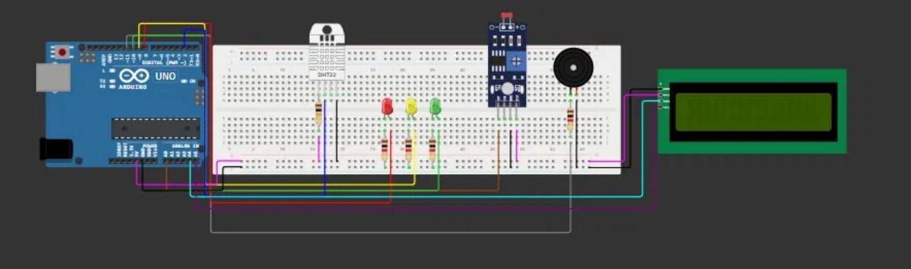

# Vinheria Agnello - Sistema de Monitoramento do Ambiente
Este projeto tem como principal objetivo atender às necessidades da Vinheria Agnello, que preza pela qualidade e tradição de seus vinhos. Para isso, foi desenvolvido um sistema de monitoramento de luminosidade, umidade e temperatura utilizando Arduino, capaz de identificar as condições de luz no ambiente e alertar o usuário por meio de LEDs, um buzzer e um display LCD quando os níveis estiverem fora do ideal.

Este sistema de monitoramento ambiental utiliza um Arduino para coletar 
e exibir em tempo real dados do ambiente. Por meio de um sensor LDR 
(Light Dependent Resistor), um sensor DHT11 e um display LCD, o sistema 
é capaz de monitorar a luminosidade, a temperatura e a umidade do 
ambiente simultaneamente.

Os dados coletados são exibidos no display LCD com mensagens de status, 
indicando se as condições do ambiente estão dentro dos níveis ideais. 
Além disso, LEDs sinalizam visualmente o estado da luminosidade e um 
buzzer emite alertas sonoros quando os níveis estiverem fora do ideal.

---

## Objetivo
Desenvolver um sistema capaz de:
- Monitorar a luminosidade do ambiente utilizando um sensor LDR;
- Monitora a temperatura e umidade do ambiente utilizando um sensor DHT11;
- Indicar o estado do ambiente por meio de LEDs;
- Emitir alerta sonoro com buzzer quando a luminosidade estiver fora do ideal;
- Exibir os valores de luminosidade, temperatura e umidade em um display LCD. 

---

## Dependências

### Hardware
- Arduino Uno;
- Sensor LDR;
- Sensor DHT11;
- Display LCD;
- LEDs (verde, amarelo e vermelho);
- Resistores (220Ω); 
- Buzzer;
- Protoboard;
- Jumpers.

### Software
- [Simulação (Clique Aqui)]()
- Arduino IDE.

---

## Como executar

1. Monte o circuito em um Arduino com protoboard, ou no Tinkercad;
2. Conecte o LDR à entrada analógica do Arduino;
3. Conecte os LEDs às portas digitais com os resistores;
4. Conecte o buzzer a uma porta digital;
5. Conecte o sensor DHT11 a uma porta digital do Arduino;
6. Conecte o display LCD ao Arduino via interface I2C;
7. Faça o upload do código para o Arduino (código disponível neste repositório);
8. Execute o código com o circuito montado;
9. Varie a luminosidade no LDR e observe os valores exibidos no display LCD.

---

## Lógica e Funcionamento do Sistema

O sensor LDR fornece valores analógicos entre 0 e 1023, representando 
a intensidade da luz no ambiente. O sensor DHT11 realiza a leitura da 
temperatura e umidade. O display LCD exibe em tempo real os valores 
coletados pelos sensores, com mensagens de status conforme as condições 
do ambiente:

**Temperatura:**
- **Linha 1:** `Temperatura OK` / `Temp. ALTA` / `Temp. BAIXA`
- **Linha 2:** valor lido pelo DHT11 (ex: `Temp. = 10.5C`)

**Umidade:**
- **Linha 1:** `Umidade OK` / `Umidade ALTA` / `Umidade BAIXA`
- **Linha 2:** valor lido pelo DHT11 (ex: `Umidade = 57%`)

**Luminosidade:**
- **Linha 1:** `Ambiente muito CLARO` / `Ambiente a meia luz` / `Ambiente Ok`
- **Linha 2:** (estado da luminosidade conforme o nível lido pelo LDR)

Com base em limites definidos no código, o Arduino classifica o nível de 
iluminação em três estados e aciona os LEDs e o buzzer conforme necessário:

- **Ideal:** LED verde aceso
- **Alerta:** LED amarelo aceso
- **Crítico:** LED vermelho aceso + buzzer ativado por 3 segundos

Caso a luminosidade permaneça inadequada, o buzzer será acionado novamente.

---

### Circuito do Projeto

  

### Vídeo explicativo sobre a proposta do circuito: 

[Clique aqui e seja direcionado.](https://youtu.be/8J8kwzvKLeE?feature=shared) 

## Grupo: SheCodes
Amanda Lourenço - 572572
Giovanna Scalzone - 572285
Nayra Duarte - 573815
Paloma Dantas - 569995

